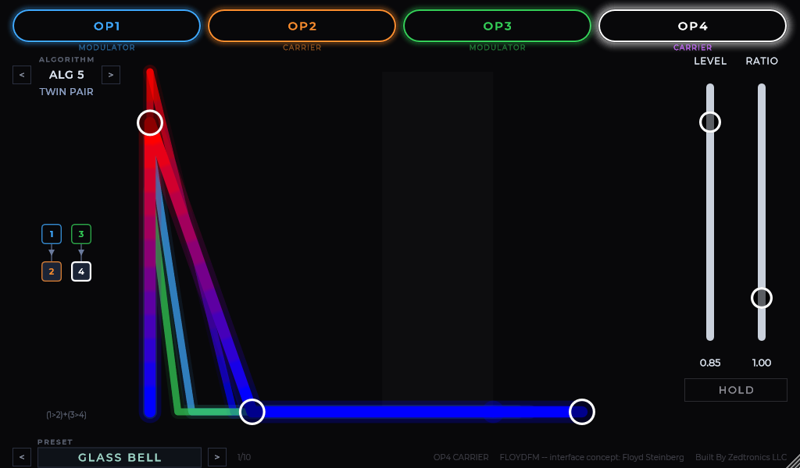
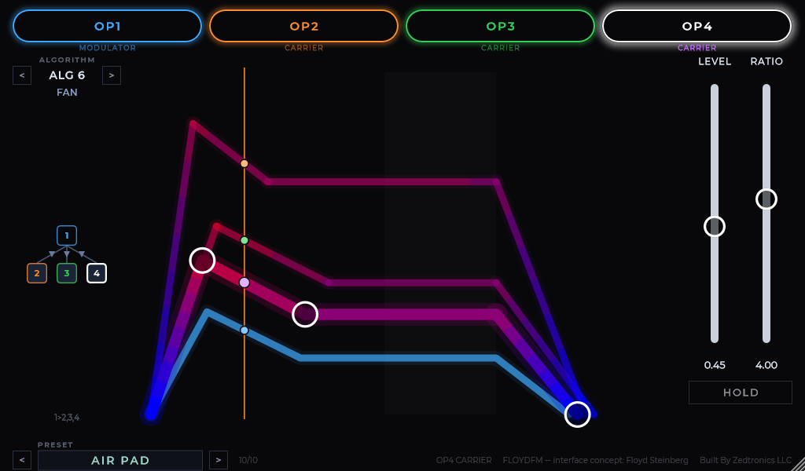

# FloydFM

A four-operator FM synthesizer with a direct-manipulation envelope editor: all
four operator envelopes on one shared absolute time axis, edited by dragging
breakpoints.

JUCE 8. **VST3, AU and LV2** -- the LV2 build is the full plugin, editor and
all, so Linux users get the same interface as everyone else. MIT licensed.

**[Ready-made builds are free at zedtronics.net](https://zedtronics.net/free/floydfm)**
-- Windows VST3 and LV2, headless Linux LV2. No account, no strings.



---

## Attribution

**The interface concept originates with [Floyd Steinberg](https://www.youtube.com/@mr_floydst), who published it as a
design idea and explicitly invited reuse.**

Floyd published no source code. This is an independent implementation written
from his description. The credit also appears in the plugin's preset bar and in
its Help > About tab.

Working title. The plugin code (`Flfm`) and name are provisional.

---

## What it does

- **4 operators**, phase-accumulator sine only. No wavetables.
- **8 algorithms** -- the canonical Yamaha 4-op set (DX21 / DX27 / DX100 /
  TX81Z, YM2151 "OPM" connections 0-7), named for what each is good for.
- **Shared-axis envelope editor.** Every operator's envelope is drawn on one
  fixed absolute time axis, so a fast modulator dying under a slow carrier is
  visible rather than hidden. Three drag handles on the selected operator set
  attack/amount, decay/sustain, and release.
- **8-voice polyphony**, velocity scaling modulator depth (play harder ->
  brighter, not just louder).
- **10 factory presets.**
- **Drag-to-zoom**, 0.75x to 2.0x, aspect locked, persisted with the session.
- **Arrow-key navigation**, circular in both directions: left/right steps
  presets, up/down steps algorithms.

Each operator tab is labelled CARRIER or MODULATOR for the current algorithm.
That is the FM lesson in one line: a carrier is heard directly, a modulator is
only heard through what it changes -- which is also why the left slider reads
LEVEL for one and DEPTH for the other.

Operator colour is identity and never changes. Selection is carried by stroke
weight and glow, so colour always answers "which line is which" when four
envelopes overlap.



---

## Build

Requires CMake 3.22+ and a C++17 toolchain. JUCE 8.0.12 is fetched at configure
time; nothing is vendored.

```powershell
cmake -B build -G "Visual Studio 17 2022" -A x64 -DCMAKE_VS_NO_COMPILE_BATCHING=ON
cmake --build build --config Release --target FloydFM_VST3 --parallel 1
cmake --build build --config Release --target FloydFM_LV2 --parallel 1
```

On Linux, LV2 is the format that matters and JUCE needs its usual X11 stack:

```bash
sudo apt install build-essential pkg-config libasound2-dev libjack-jackd2-dev \
  libfreetype-dev libx11-dev libxcomposite-dev libxcursor-dev libxext-dev \
  libxinerama-dev libxrandr-dev libxrender-dev libglu1-mesa-dev
cmake -B build -DCMAKE_BUILD_TYPE=Release
cmake --build build --target FloydFM_LV2
```

On Windows, if the JUCE `juceaide` sub-build fails with
`cl : command line error D8040`, set these first -- the sub-build inherits the
environment but not CMake cache variables:

```powershell
$env:CL = "/MP1"
$env:CMAKE_BUILD_PARALLEL_LEVEL = "1"
```

macOS builds set `CMAKE_OSX_DEPLOYMENT_TARGET=10.13` automatically.

### Development harness

`FloydFMRender` is a headless dev tool, excluded from the default build. It
renders the UI offscreen and smoke-tests the DSP without opening a DAW.

```powershell
cmake --build build --config Release --target FloydFMRender --parallel 1
$h = "build\FloydFMRender_artefacts\Release\FloydFMRender.exe"

& $h panel.png 10 2.0  # render the panel; optional preset index and zoom
& $h --verify-layout   # print compiled layout constants for spec comparison
& $h --audio-test      # held C4 + a chord, every preset and every algorithm
```

`--audio-test` reports peak level and, crucially, how much gain reduction the
master limiter applied. Output peak alone cannot reveal an over-hot signal
buried in a limiter -- the limiter asymptotes at unity, so the level looks fine
while the sound is being distorted.

---

## Architecture

Signal flow:

```
MIDI note -> Voice (x8) -> 4 sine operators routed by algorithm
          -> carrier sum -> master level -> soft-clip limiter -> output
```

Two headers are single sources of truth, and both are read by the DSP *and* the
UI so they cannot drift apart:

| File | Owns |
|---|---|
| `Source/DSP/Algorithm.h` | The 8 algorithms. Read by the voice's render order, the routing diagram's row layout, and the parameter's choice list. |
| `Source/DSP/EnvelopeShape.h` | Envelope shape. The voice ticks the same piecewise-linear functions the canvas draws breakpoints from. There is no `juce::ADSR` in this plugin -- it has no value-at-time-t query, so display and audio would drift. |

Notes on the FM core:

- Phase is normalised 0..1. Cross-operator modulation is summed **raw** into the
  downstream phase accumulator (`phase + modInput`). Dividing by 2*pi caps each
  stage's modulation index at 1 radian and makes cascades sound thin against
  DX7-lineage references.
- Only self-feedback (OP1) converts through 2*pi, because it is expressed in
  radians and clamped.
- Ratios are a 19-value snapped choice, not continuous. Non-simple ratios throw
  inharmonic sidebands that read as aliasing; detune covers the in-between.
- Gain staging is deliberate and load-bearing. Carriers sum coherently, so each
  voice is scaled by `1/sqrt(carrier count)` to level-match the algorithms, and a
  fixed output trim leaves headroom for chords. The master limiter is then a
  safety net that stays idle in ordinary playing rather than a distortion stage
  the signal lives inside.

`FLOYD-FM-HANDOFF.md` is the design specification;
`zedlab-fm-brightness-v11.jsx` is the reference mockup it was drawn from.

---

## Status

Working. Validated with pluginval at strictness 5, 7, and 10 (three runs at
level 10), all passing. Reports in `pluginval-reports/`.

The DSP smoke test reports master-limiter gain reduction for both a held note and
a four-note chord; both currently sit under 0.4 dB, meaning the limiter is not
colouring ordinary playing.

The factory presets have been ear-audited and sound like their intended
instruments.

Known gaps:

- No help overlay or tooltips yet.
- AU is configured but has only been validated as VST3 on Windows.
- The LV2 build is verified on Windows; the Linux LV2 build has not been run.

### Two LV2 builds, on purpose

| | This repo (JUCE) | [FloydFM-Pi](https://github.com/JonathanZeppa/FloydFM-Pi) (Rust) |
|---|---|---|
| Bundle | `FloydFM.lv2` | `FloydFM-Pi.lv2` |
| URI | `.../floydfm` | `.../floydfm-pi` |
| UI | Full editor (`ui:X11UI` / `ui:WindowsUI`) | None -- headless |
| Parameters | LV2 patch extension (`lv2:Parameter`) | Classic control ports |
| Size | ~7.7 MB | ~334 KB |
| For | Linux desktop | Zynthian / Raspberry Pi |

Distinct URIs, so both can be installed at once. The Pi build uses classic
control ports deliberately: they have the broadest host support, which matters
more on an embedded host than the patch extension's flexibility does.

### The brightness gradient

Floyd's signature idea: a carrier's envelope is drawn as a cold-to-hot gradient
showing where the tone is bright and where it is dark. It shipped after Floyd
described the metric himself:

> The gradient shows the brightness of the sound (or the overall modulation
> strength). Add up all the modulators' values on the Y-axis and divide by the
> number of modulators, then map the result to a colour index that goes from
> colour 1 to colour 2. Then use the result for colouring the carrier's graph.

He described the scale itself in the video the interface came from: the result is
normalised and mapped from pure blue to pure red, and the carrier's curve is
drawn in twelve possible shades from left to right. Both details are kept -- the
banding is not a limitation he worked around, it is what makes "this section is
one shade brighter than that one" something the eye can actually judge.

So brightness at any point in time is the mean of the operators modulating that
carrier -- envelope value times amplitude, since amplitude is part of the
y-value. A modulator turned down, or one that has decayed away, is a dark
carrier. The line runs pure blue through violet and magenta to pure red as the
modulation gets stronger, and the glow under it carries the same colour, so a
bright section glows red.

Normalisation is against the patch's own peak, one scale for the whole picture so
carriers stay comparable to each other. The divisor has a floor
(`kBrightnessRefPeak`): dividing by the peak alone would blow a barely-modulated
patch up to full red and claim a brightness that is not there, so a genuinely
dark patch stays dark while any normally-driven patch uses the full scale.

The normalised value passes through a perceptual curve (`kBrightnessGamma`)
before the twelve-shade quantise. Floyd's own Y-axis was a TX81Z-family operator
level, which runs in decibel-sized steps -- a log-amplitude axis -- where this
synth's amplitude is linear, and the voice sums modulator output straight into
phase, so a modulator at half amplitude still carries a modulation index of
roughly pi and is plainly bright to the ear. Mapping linear amplitude straight to
a colour index painted such a sound mid-blue while it was still shimmering; the
curve restores the domain Floyd's own screen was averaging in.

Two readings of "all the modulators" are possible in a 4-operator patch, because
a modulator can reach a carrier through another modulator. This build uses every
operator upstream of the carrier, not only the ones feeding it directly: on a
1>2>3>4 stack the direct reading would colour OP4 from OP3 alone and show a flat
line while OP1 and OP2 were plainly changing the timbre.

A carrier with nothing modulating it -- every operator in ADDITIVE, the bare
sines in PAIR+SINE -- has no brightness to show, so it keeps its identity colour
rather than being painted the cold end of a scale it is not on.

Floyd also suggested a small circle riding the envelope so you can see exactly
where in the graph the sound currently is. There is one per operator, in that
operator's identity colour, moving along its own line with the playhead.

The metric lives in `Source/UI/Brightness.h` and reads the same envelope math the
voice ticks and the same routing table the voice renders through, so the picture
cannot drift from the sound.

---

## Licence

MIT -- see `LICENSE`. Montserrat is bundled under the SIL Open Font License 1.1
(`Resources/Fonts/OFL.txt`). JUCE is fetched at build time and licensed
separately.
